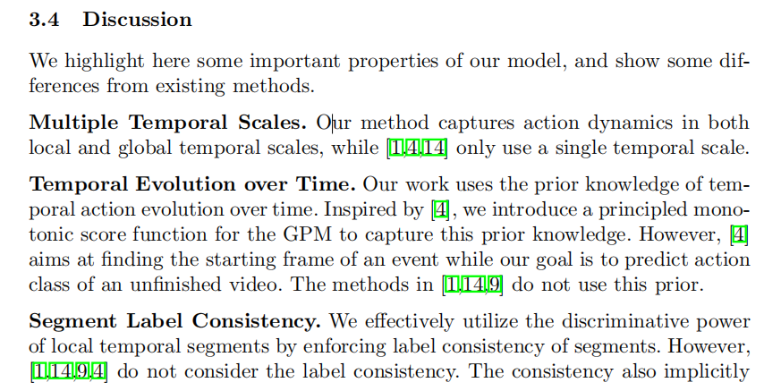

# A Discriminative Model with Multiple Temporal Scales for Action Prediction
(前情概要:作为阅读这个领域第一篇论文,虽然文章内容偏向于机器学习(SVM),和深度学习网络有一定区别,但文章设计思想值的借鉴,全局和局部信息分开处理,然后融合,这为后面模型有一定启发.在此之前阅读过一篇"TAM: TEMPORAL ADAPTIVE MODULE FOR VIDEO RECOGNITION",也是运用局部信息和全局信息的融合实现,可见这种思想对后面有一定启发.在查阅资料发现,本篇论文很少有人作出博客讲解,希望能分享自己鄙见.)

## 相关信息

论文名称: A Discriminative Model with Multiple Temporal Scales for Action Prediction
 
论文作者: Yu Kong, Dmitry Kit, and Yun Fu1
 
下载地址: https://projet.liris.cnrs.fr/imagine/pub/proceedings/ECCV-2014/papers/8693/86930596.pdf
 

## 论文概述

所谓的动作预测,是在动作即将发生之前能够判断动作类型,而越早能预测出来对视频检测,灾难预警很极大意义.为了实现动作预测和提高视频开始部分的区别动作的能力,作者提出多重时序尺度的支持向量机(MTSSVM).论文围绕这样一个模型设计展开,简单来说模型既能读取"全局"信息,也能读取部分信息,模型在某些方面加了一些限制提高效率等,最终作者取得满意的效果.

## 论文要点

### 论文的作者想要完成什么，或者已经完成了什么？

论文目的在3.4节说明,如下图

  
  

通俗来说作者贡献有:

1. 设计一种多重时序尺度,即不是从单一角度来看待输入的数据(视频),而是结合了局部片段视频和全局获得的视频,对两方面进行评估获得不错的效果
2. 针对于时间的评价方法.在我的理解来看,如果取视频的1/2来预测和3/4来预测,那么3/4分数势必要比1/2的高(有可能后面的片段拉低了评分),但3/4视频评分机制是在基于1/2基础上作加,所以一定会大于.作者在这里面说明这会随着时间获得先验知识.同时之前的模型不同在于选自于动作事件发生的开始而文中针对于一个不完整的视频.
3. 片段级别的限制,这个读过论文可能会理解透彻一些,简单来说作者设计一些优化过程的限制条件能限制类别标签,动作评估,增强动作区分类别能力等,有助于最终效果.
4. 作者设计一个经验风险函数来优化模型,提升识别效果,即损失函数设计

### 如果一篇论文介绍了一种新方法/技术/方法，那么该新方法的关键要素是什么?

这里对上面方法做一个详细的解读
1. 作者对数据的处理

### 论文中哪些内容对你有用?

由于方法的局限性,论文对于后面研究深度学习可能帮助不是很大,但我觉得研读后面发表论文来看,论文所做出的的贡献值的参考的主要有:

### 你还想关注哪些参考文献?

## 思维导图

## 相关code

暂未发现 :sweat_smile:

