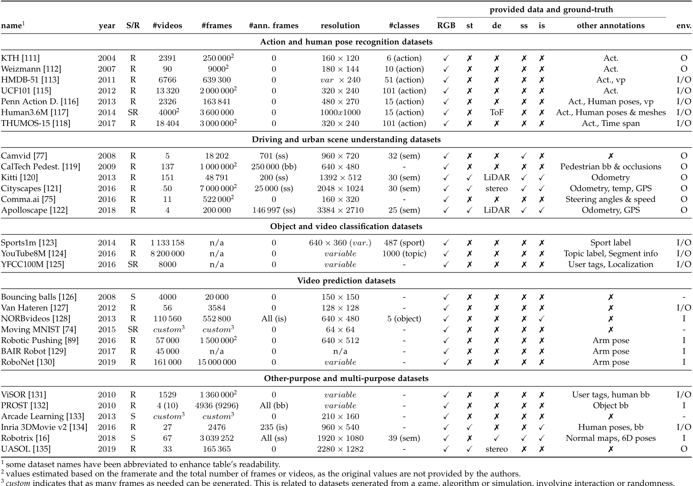

- [A Review on Deep Learning Techniques for Video Prediction](#a-review-on-deep-learning-techniques-for-video-prediction)
  - [相关信息](#相关信息)
  - [文章摘要](#文章摘要)
- [文章主体内容](#文章主体内容)
  - [核心任务](#核心任务)
  - [处理随机性](#处理随机性)
  - [损失函数特点](#损失函数特点)
  - [Backbone](#backbone)
    - [CNN](#cnn)
    - [RNN](#rnn)
    - [GAN](#gan)
  - [数据集](#数据集)
  - [GAN(Video prediction)](#ganvideo-prediction)
- [具体方法介绍](#具体方法介绍)
  - [粗略分类](#粗略分类)
  - [Direct Pixel Synthesis](#direct-pixel-synthesis)
  - [Using Explicit Transformations](#using-explicit-transformations)

# A Review on Deep Learning Techniques for Video Prediction

## 相关信息

论文名称: A Review on Deep Learning Techniques for Video Prediction
 
论文作者: S. Oprea, P. Martinez-Gonzalez, A. Garcia-Garcia .et
 
下载地址: https://arxiv.org/abs/2004.05214
 

## 文章摘要

The ability to predict, anticipate and reason about future outcomes is a key component of intelligent decision-makingsystems. In light of the success of deep learning in computer vision, deep-learning-based video prediction emerged as a promisingresearch direction. Defined as a self-supervised learning task, video prediction represents a suitable framework for representationlearning, as it demonstrated potential capabilities for extracting meaningful representations of the underlying patterns in natural videos.Motivated by the increasing interest in this task, we provide a review on the deep learning methods for prediction in video sequences.We firstly define the video prediction fundamentals, as well as mandatory background concepts and the most used datasets. Next, wecarefully analyze existing video prediction models organized according to a proposed taxonomy, highlighting their contributions andtheir significance in the field. The summary of the datasets and methods is accompanied with experimental results that facilitate theassessment of the state of the art on a quantitative basis. The paper is summarized by drawing some general conclusions, identifyingopen research challenges and by pointing out future research directions

(预测、预测和推断未来结果的能力是智能决策系统的关键组成部分。随着深度学习在计算机视觉领域的成功应用，基于深度学习的视频预测成为一个有前途的研究方向。视频预测被定义为一项自我监督的学习任务，它代表了一个合适的表征学习框架，因为它展示了在自然视频中提取底层模式的有意义表征的潜在能力。受对这项任务日益增长的兴趣的激励，我们回顾了视频序列预测的深度学习方法。我们首先定义了视频预测的基本原理，以及强制性的背景概念和最常用的数据集。接下来，我们仔细分析了现有的视频预测模型，这些模型是根据建议的分类法组织的，强调了它们的贡献及其在该领域的意义。数据集和方法的总结与实验结果一起，有助于在定量基础上评估最新技术。本文通过得出一些一般性结论、识别开放研究挑战以及指出未来研究方向来总结)

简单来说目前目前未有对该领域作出调研,文章首次以视频预测为出发点来展开.

# 文章主体内容

## 核心任务

关于视频预测主要目的如下图所示: given a sequence of video frames as context, predict the subsequent frames –generation of continuing video given a sequence of previous frames.(给定一系列视频帧作为上下文，预测后续帧——给定一系列先前帧的连续视频的生成。)

  

任务特点: learning by prediction is a self-supervised task, filling the gap between supervised and unsupervised learning(通过预测学习是一项自我监督的任务，填补了监督学习和无监督学习之间的空白)

## 处理随机性

  

Most of the existing deep learning-based models in theliterature are deterministic. Although the future is uncertain,a deterministic prediction would suffice some easily pre-dictable situations. For instance, most of the movement of acar is largely deterministic, while only a small part is uncer-tain. However, when multiple predictions are equally prob-able, a deterministic model will learn to average betweenall the possible outcomes This unpredictability is visuallyrepresented in the predictions as blurriness, especially onlong time horizons. As deterministic models are unable tohandle real-world settings characterized by chaotic dynam-ics, authors considered that incorporating uncertainty to the model is a crucial aspect.(文献中现有的大多数基于深度学习的模型都是确定性的。 尽管未来是不确定的，但确定性的预测足以应对一些容易预测的情况。 例如，汽车的大部分运动在很大程度上是确定性的，而只有一小部分是不确定的。 然而，当多个预测的可能性相同时，确定性模型将学习在所有可能的结果之间求平均值。这种不可预测性在预测中被直观地表示为模糊性，尤其是在很长的时间范围内。 由于确定性模型无法处理以混沌动力学为特征的现实世界设置，作者认为将不确定性纳入模型是一个关键方面。)

由上面可以看出所以概率模型在这里有很大意义

## 损失函数特点

## Backbone

### CNN

### RNN

### GAN

## 数据集

1. Action and Human Pose Recognition Datasets: KTH, Weizmann, HMDB-51, UCF101, PENN Action Dataset, Human3.6M, THUMOS-15
2. Driving and Urban Scene Understanding Datasets:Cam Vid, CalTech Pedestrian Dataset, Kitti, Cityscapes, Comma.ai steering angle, Apolloscape
3. Object and Video Classification Datasets:Sports1M, Youtube-8M, YFCC100M
4. Video Prediction Datasets:Standard bouncing balls dataset, Van Hateren Dataset of natural videos, NORBvideos, Moving MNIST, Robotic Pushing Dataset, BAIR Robot Pushing Dataset, RoboNet
5. other:

## GAN(Video prediction)
(发表日期-引用量)

1. Deep multi-scale video prediction beyond mean square error(2016.11-264)
   
   学习从视频序列预测未来的图像涉及构建内部表示，即精确地模拟图像演变，因此在某种程度上，其内容和动态模拟。这就是为什么像素空间视频预测可以被视为未经监督特征学习的承诺大道。此外，在很长一段时间内，光流量在计算机视觉中已经进行了非常研究的问题，但很少接近未来的帧预测。尽管如此，许多愿景应用程序可能会受益于视频的下一个视频帧的知识，这不需要跟踪每个像素轨迹的复杂性。在这项工作中，我们训练卷积网络以产生给定输入序列的未来帧。为了处理从标准均方误差（MSE）损失函数中获得的固有模糊预测，我们提出了三种不同和互补的特征学习策略：多尺度架构，对抗训练方法和图像梯度差损失功能。我们将我们的预测基于UCF101数据集的经常性神经网络对不同公布的结果进行了比较

2. Unsupervised Learning of Visual Structure using Predictive Generative Networks(2015.12-133)
   
   预测未来环境国家的能力是智力的核心支柱。在其核心，有效的预测需要世界内部模型，了解世界变化的规则。在这里，我们使用基于CNN-LSTM-DECNN框架，使用基于预测合成视频序列中的未来帧的损失训练的深神经网络开发的内部模型。首先表明该架构可以在视觉序列预测任务中实现出色的性能，包括标准的“弹跳球”数据集中的最先进的性能（Sutskever等，2009）。使用加权平均平方误差和对抗性损失（Goodfellow等，2014），相同的架构成功推断了计算机产生的面的平面外旋转。此外，尽管训练了端到端以预测像素级信息，但我们的预测生成网络学习底层三维物体本身的潜在结构的表示。重要的是，我们发现该表示自然宽容对象转换，并概括到新任务，例如静态图像的分类。仅采用重建损失培训的类似型号未能呈现为有效。我们认为预测可以作为学习高级对象特征的丰富内部表示的强大无人监督损失。

3. Learning Object-Centric Transformation for Video Prediction(2017.10-8)
   
   视频序列的未来帧预测是一个具有挑战性的任务，值得探索计算机愿景问题。现有方法通常学习整个图像的运动信息以预测下一个帧。然而，同一场景中的不同对象通常直观地以不同的方式移动和变形。考虑到人类视觉系统，人们经常注意包含关键运动信号的关键对象，而不是将整个图像压缩成静态表示。在这项工作中，受到人类感知的这种特性的推动，我们开发了一种新的以中心为中心的视频预测模型，用于动态地学习局部运动转换，以便对视觉注意的关键对象区域。通过迭代地将对象转换为原始输入帧，可以产生下一个帧。具体而言，我们设计具有可更换策略的注意模块，以自动参加视频帧中的对象。我们的方法在培训程序期间不需要任何注释数据。为了产生尖锐的预测，我们的工作采用了对抗性培训。与现有方法相比，我们在移动Mnist和UCF101数据集中评估我们的模型，并报告竞争结果。所生成的帧证明我们的模型可以表征不同对象的运动并产生合理的未来帧。

4. Video Scene Parsing with Predictive Feature Learning(2017.10-79)

   视频场景解析由于以下两个原因是挑战：首先，学习有意义的视频表示为生产时间一致的标签图来说是非琐碎的;其次，这种学习过程变得更加困难，标记的视频训练数据不足。在这项工作中，我们提出了一个统一的框架来解决上述两个问题，这是我们知道在视频场景解析中采用预测特征学习的第一个模型。预测特征学习在两个预测任务中执行：帧预测和预测解析。实验证明，我们模型中的学习预测特征能够通过与标准图像解析网络组合来显着提高视频解析性能。有趣的是，预测学习所带来的性能收益几乎是成本不成本，因为这些功能从大量未标记的视频数据以无人监督的方式学习。在两个具有挑战性的数据集，城市景观和Camvid上进行了广泛的实验，通过显示出良好的建立了显着改善，表明了我们模型的有效性

5. Hierarchical Long-term Video Prediction without Supervision(2018.6-37)

   最近的一些研究已经致力于视频预测和一代，但之前的大多数作品都在在短期视野上产生了有限的成功。 Villegas等人的分层视频预测方法。 （2017）是用于长期视频预测的最先进方法的示例，但它们的方法是有限的，因为它需要在训练时间进行地面真理注释高级结构（例如，人类联合地标）。我们的网络对输入帧进行编码，预测到将来的高级编码，然后具有对第一帧的访问的解码器从预测的编码产生预测图像。解码器还产生掩模，该掩模将预测的前景对象（例如，人）概述为副产品。与Villegas等人不同。 （2017），我们开发了一种新颖的培训方法，共同训练编码器，预测器和解码器在一起，没有高速监督;我们通过在特征空间中的对抗性损失来进一步改善这一点来训练预测因子。我们的方法可以预测到未来约20秒，与丹顿和弗格兰（2018）和Finn等人相比提供了更好的结果。 （2016）在人类3.6M数据集上。

6. Learning to Generate Long-term Future via Hierarchical Prediction(2017.6-108)
   
   我们提出了一种分层方法，用于制定未来框架的长期预测。为了避免递归像素级预测中固有的复合误差，我们建议首先估计输入帧中的高级结构，然后预测该结构在将来发展，最后通过从过去观察单个帧和预测的高-Level结构，我们构建未来的帧而无需观察到任何像素级预测。通过循环观察预测帧，难以执行长期视频预测，因为像素空间中的小误差随着预测中的预测，进入未来。我们的方法通过删除需要观察预测帧来防止像素级错误传播发生。我们的模型采用LSTM和基于类比的编码器 - 解码器卷积神经网络的组合而构建，其独立地预测视频结构并分别生成未来帧。在实验中，我们的模型在人类3.6M和PENN动作数据集上进行了对人类执行动作的长期像素级视频预测的任务，并展示了比最先进的结果更好的结果。

7.  The Pose Knows: Video Forecasting by Generating Pose Futures(2017.4-41)
   
    视频预测中的当前方法尝试直接在像素空间中直接生成视频（GANS）或变形Autiachoders（VAES）。但是，由于这些方法尝试立即模拟所有结构和场景动态，因此在不约束的设置中，它们通常会产生未解释的结果。我们的洞察力是以更高级别的抽象模拟预测问题。具体而言，我们利用人类的姿势探测器作为自由的监督来源，并将视频预测问题分为两个离散的步骤。首先，我们明确地模拟了场景中的活跃物体的高级结构---人类 - 并使用VAE模拟姿势空间中可能的未来运动。然后，我们使用将未来的姿势作为条件信息生成给GaN来预测像素空间中的视频的未来帧。通过使用构成的结构化空间作为中间代表性，我们可以避免GAN直接生成视频像素的问题。我们通过定量和定性评估表明我们的方法优于最先进的视频预测方法。

8.  Dual Motion GAN for Future-Flow Embedded Video Prediction(2017.8-2)
   
    视频中未来的帧预测是无监督视频表示学习的有希望的大道。通过基于视频中的外观和运动动态，由前帧的固有像素流动自然产生视频帧。然而，现有方法侧重于直接幻觉的像素值，导致模糊的预测。在本文中，我们开发了一种双重运动生成的对抗网（GaN）架构，其学会明确地实施未来帧预测，以通过双学习机制与视频中的像素 - 明智的流程一致。原始未来帧预测和双未来流预测形成闭环，以彼此产生信息的信息，以获得更好的视频预测。为了使合成的未来框架和流动与现实无法区分，提出了一种双对抗训练方法，以确保未来流预测能够帮助推断逼真的未来框架，而未来帧预测依次导致现实的光学流动。我们的双运动GaN还通过新的概率运动编码器处理不同像素位置的自然运动不确定性，这是基于变形式自动化器。广泛的实验表明，所提出的双运动GaN显着优于综合新视频帧和预测未来流动的最先进方法。我们的模型概括了各种视觉场景，并在无监督的视频表示学习中显示出优越性。

9.  A Novel Adversarial Inference Framework for Video Prediction with Action Control(2019.10-4)
    
    预测视频序列中的未来帧的能力，称为视频预测，是计算机视觉中的一种吸引人但具有挑战性的任务。此任务需要深入的视频序列表示以及对实际因果规则的深刻理解。现有方法经常导致模糊预测并缺乏行动控制能力。为了解决这些问题，我们提出了一个框架，称为VPGAN，它采用了对抗性推理模型和循环一致性损失功能，以赋予框架以获得更准确的预测。另外，我们将共形映射网络结构纳入VPGan以使动作控制能够产生所需的未来帧。通过这种方式，VPGAN能够生产沿着特定方向移动的物体的假视频。实验结果表明，具有一些预先训练的图像分割模型的VPGAN组合优于现有的随机视频预测方法。

10. Decomposing Motion and Content for Natural Video Sequence Prediction(2017.6-160)
    
    我们提出了一种深度神经网络，用于预测天然视频序列中的未来帧。为了有效处理视频中的像素的复杂演化，我们建议分解运动和内容，两个关键组件生成视频中的动态。我们的模型是基于编码器 - 解码器卷积神经网络和卷积LSTM，用于像素级预测，其独立地捕获图像的空间布局和相应的时间动态。通过独立建模的运动和内容，预测下一个帧减少了通过所识别的运动特征将提取的内容特征转换为下一个帧内容，这简化了预测的任务。我们的模型是在多个时间步骤的端到端培训，并且自然学会在没有单独的训练的情况下分解运动和内容。我们使用Kth，Weizmann Action和UCF-101数据集评估人类活动视频上提出的网络架构。与最近的方法相比，我们表现出最先进的性能。据我们所知，这是第一个端到端的培训网络架构，具有运动和内容分离，以模拟天空动力学，用于自然视频中的像素级未来预测。

11. Generating Videos with Scene Dynamics(2016.9-489)
    
    我们利用大量未标记的视频，以便学习视频识别任务（例如动作分类）和视频生成任务的场景动态模型（例如，未来预测）。我们向视频提出了一种用于视频的生成对抗网络，其时空卷积架构从背景中解开了场景的前景。实验表明，这种模型可以在完全帧速率下产生微小的视频，而不是简单的基线，我们在预测静态图像的合理期货时显示其实用程序。此外，实验和可视化表明该模型在内部学习了有用的特征，以识别具有最小监督的动作，表明场景动态是表示学习的有希望的信号。我们认为生成视频模型可以影响视频理解和仿真中的许多应用。

12. MoCoGAN: Decomposing Motion and Content for Video Generation(2017.6-55)
    
    视频中的可视信号可分为内容和运动。虽然内容指定了视频中的对象，但动作描述了它们的动态。基于此之前，我们提出了用于视频生成的运动和内容分解的生成对抗网络（MoCoGan）框架。所提出的框架通过将一系列随机向量映射到一系列视频帧来生成视频。每个随机向量由内容部分和运动部分组成。虽然内容部分保持固定，但是运动部分被实现为随机过程。为了以无监督的方式学习运动和内容分解，我们利用图像和视频鉴别器介绍一种新的对抗性学习方案。关于具有与最先进的方法进行定性和定量比较的几个具有挑战性的数据集，验证了拟议框架的有效性的大量具有挑战性的数据集。此外，我们表明Mocogan允许一个人生成具有相同内容但不同运动以及具有不同内容和相同运动的视频的视频。

13. Flexible Spatio-Temporal Networks for Video Prediction(2017.6-77)
    
    我们描述了一种用于视频帧预测的模块化框架。我们将其称为灵活的时空网络（FSTN），因为它允许视频序列的外推以及观察到的帧之间的合成帧的估计，从而产生慢动作视频。通过设计包括解码，编码和对抗损失的定制的目标函数，我们能够减轻模糊预测的常见问题，即使对于相对较远的未来预测，管理也能够保持高频信息。我们提出并分析了不同的培训策略来优化我们的模型。关于几个挑战性的公共数据集的广泛实验表明了我们模型的多功能性和有效性。

14. Predicting Future Frames Using Retrospective Cycle GAN(2019.6-66)
    
    深度学习的最新进步已经显着提高了视频预测的性能，然而，顶级执行算法开始产生模糊预测，因为它们试图预测未来的未来框架。在本文中，我们提出了一个统一的生成的对抗网络，即使在一个具有挑战性的环境中，即使在一个具有挑战性的环境中，也会随着时间的推移预测准确和时间持续的未来帧。关键的想法是训练一个可以预测未来和过去帧的单个发电机，同时使用回顾性周期约束来强制执行双向预测的一致性。此外，我们使用两位鉴别者不仅要识别假帧，而且还用于区分虚假含有的图像序列从实际序列。后一种鉴别器，序列鉴别器，在预测时间上一致的未来框架中起着至关重要的作用。我们通过用车载相机，监控摄像头和具有最先进的方法捕获的各种现实视频来实验验证所提出的框架。

15. Generating the Future with Adversarial Transformers(2017.6-142)
    
    我们学习模型以在视频中生成即时的未来。这个问题有两个主要挑战。首先，由于未来不确定，模型应该是多模态，这可能难以学习。其次，由于未来类似于过去，模型存储低级细节，这使得高级语义的学习复杂化。我们提出了一个框架来解决这两种挑战。我们提出了一种通过在过去转换像素来产生未来的模型。我们的方法明确地解除了预测的模型内存，这有助于模型学习理想的修正。实验表明，该模型可以产生合理的期货的短视频。我们认为预测模型在机器人，医疗保健和视频理解中有许多应用。

16. Learning Temporal Transformations From Time-Lapse Videos(2016.8-0)
    
    基于自然界中的物理，化学和生物学现象的终生长观察，人类经常在他们的脑海中容易地描绘在未来的物体看起来像什么。但是，计算机怎么样？在本文中，我们从延时视频学习对象转换的计算模型。特别是，我们探讨了生成模型，在将来时创建对象的描述。这些模型探索了几个不同的预测任务：给定个对象的单个描绘产生未来状态，在不同时间考虑到对象的两个描绘，并在经常性框架中递归地生成未来状态。我们为生成的结果提供定性和定量评估，并进行人类评估以比较模型的变化。

17. Temporal Coherency based Criteria for Predicting Video Frames using Deep Multi-stage Generative Adversarial Networks(2017.01-38)
    
    最近在计算机视觉和机器学习领域追捧了从一系列视频帧中预测了一系列视频帧的未来。尽管已经使用运动轨迹和流量特征进行了努力，但是没有广泛研究生成看不见的框架的复杂问题。在本文中，我们在多阶段生成的对抗网络（GaN）框架内使用卷积模型处理这个问题。该方法使用两个GAN的两个阶段来产生清晰和清晰的未来框架。虽然过去已使用GAN进行预测未来，但任何作品都没有考虑时间维中后续帧之间的关系。我们的主要贡献在于基于标准化的交叉相关（NCC）和用于解决此问题的成对对比分发（PCD）制定两个目标功能。这种方法与传统的L1损失相结合，已经尝试了三个真实世界的视频数据集，viz。 Sports-1M，UCF-101和Kitti。性能分析揭示了最近最先进的方法的卓越成果。

18. Temporal Generative Adversarial Nets with Singular Value Clipping(2016.11-15)
    
    在本文中，我们提出了一种生成模型，颞会生成的对抗网（TGAN），可以学习未标记视频的语义表示，并且能够生成视频。与现有的生成对冲网（GAN）不同的方法，用于使用由3D去卷积层组成的单个发生器产生视频的方法，我们的模型利用了两种不同类型的发电机：时间发生器和图像发生器。时间生成器将单个潜变量作为输入，输出一组潜变量，每个变量对应于视频中的图像帧。图像生成器将一组这样的潜变量转换为视频。为了处理甘培训的不稳定，我们采用最近提出的模型，Wassersein Gan，并提出了一种新的方法，以稳定地以端到端的方式训练它。实验结果表明了我们的方法的有效性。

19. Video Imagination from a Single Image with Transformation Generation(2017.10-22)
    
    在这项工作中，我们专注于一个具有挑战性的任务：综合多个虚幻视频给出单个图像。主要问题来自像素空间的高度和潜在运动的模糊性。为了克服这些问题，我们提出了一个新的框架，通过转型生成产生虚幻的视频。生成的变换应用于新颖的体积合并网络中的原始图像，以在虚数中重建帧。通过采样不同的潜变量，我们的方法可以输出不同的假想视频样本。该框架培训以对令人无知的学习的对抗方式。为了评估，我们提出了一个新的评估度量RIQA。在实验中，我们在从合成数据到自然场景的三个数据集测试。我们的框架在图像质量评估方面取得了有希望的表现。目视检查表明它可以成功地以可接受的感知质量生成不同的五帧视频。

# 具体方法介绍

## 粗略分类

作者根据其逻辑大致分为如下几类

 

##  Direct Pixel Synthesis

初始视频预测模型试图直接预测未来的像素强度，而无需任何明确的场景动态建模。

1. Video (language) modeling: a baseline for generative models of natural videos.(2014.12-478)
   
   (使用k-均值的补丁簇中的离散化视频帧。他们假设在k-均值离散化空间中，不重叠的面片是一样不同的，但是面片之间可以找到相似之处。该方法是基于RNN的模型在补丁级别进行短期预测的卷积扩展。由于全分辨率帧是由预测块组合而成，因此可以观察到一定的倾斜效应，对大型快速移动目标的预测是准确的，但是对于较小的缓慢移动的目标，仍然有改进的余地。在此基础上，本文提出了一种改进的方法，即对快速移动的大型目标的预测具有一定的准确性，但对于运动速度较慢的小目标的预测仍有改进的余地)

   我们为使用视频数据提出了一个强大的基线模型，用于无监督的功能学习。通过学习从输入视频序列预测缺失的帧或外推未来帧，模型发现了用于表示复杂变形和运动模式的空间和时间相关性。我们提出的模型主要从语言建模文献借用，并通过量化图像补片的空间来调整到视觉域名。我们展示了填充和一代任务的方法。我们首次表明，在对自然视频进行培训之后，这种模型可以在短视频序列上预测非琐碎的运动。

2. Unsupervised Learning of Video Representations using LSTMs(2015.2-943)
   
   (提出了不同的基于声发射的方法对LSTM单元进行时间一致性建模。使用卷积和Flow知觉以及RGB图像块，作者在多域任务上测试了模型，并考虑了无条件和有条件的解码器版本。后者仅略微提高了预测精度。将完全连接的LSTM替换为卷积LSTM)

   我们使用多层长期内存（LSTM）网络来学习视频序列的表示。我们的模型使用编码器LSTM将输入序列映射到固定的长度表示中。使用单个或多个解码器LSTM来解码该表示以执行不同的任务，例如重建输入序列，或者预测未来序列。我们尝试使用预制卷积网提取的视频帧的两种输入序列 - 图像像素和高级表示（“感知”）。我们探索不同的设计选择，例如解码器LSTM是否应在所生成的输出上的条件。我们分析了模型的输出定性，看模型可以将学习视频表示推向未来以及过去的程度。我们尝试可视化和解释学习的功能。我们通过在更长的时间尺度和域外数据上运行它来压力测试模型。我们进一步通过为监督学习问题 - 对UCF-101和HMDB-51数据集进行监督的学习问题来评估表示的陈述。我们表明，表示有助于提高分类准确性，尤其是当只有几个训练示例时。甚至在不相关的数据集（300小时的YouTube视频）上掠过的模型也可以帮助行动识别性能。

3. Convolutional LSTM Network: A Machine Learning Approach for Precipitation Nowcasting
(2015.6-997)

   (提出了一种有效利用空间相关性的端到端模型。这提高了预测精度，减少了参数数量)

   降水的目标是在相对较短的时间内预测当地地区未来的降雨强度。从机器学习角度研究了以前的少数前面的研究已经研究了这一重要和挑战的天气预报问题。在本文中，我们将沉淀NEVECACTION作为一种时空序列预测问题，其中输入和预测目标都是时尚血序列。通过将完全连接的LSTM（FC-LSTM）扩展到输入到状态和状态到状态转换中具有卷积结构，我们提出了卷积LSTM（ConvlStm）并使用它来构建端到端降水垂钓问题的可训练模式。实验表明，我们的Convlstm网络更好地捕获了时尚的相关性，始终如一地优于FC-LSTM和最先进的运算流动仪算法进行降水垂直。

(adversarial training部分)
1. **Deep multi-scale video prediction beyond mean square error(2015.11-264)**
   
   ( proposed the first multi-scalearchitecture for video prediction that was trained in an ad-versarial fashion. Their novel GDL regularization com-bined with `1-based reconstruction and adversarial trainingrepresented a leap over the previous state-of-the-art models  in terms of prediction sharpness)

   学习从视频序列预测未来的图像涉及构建内部表示，即精确地模拟图像演变，因此在某种程度上，其内容和动态模拟。这就是为什么像素空间视频预测可以被视为未经监督特征学习的承诺大道。此外，在很长一段时间内，光流量在计算机视觉中已经进行了非常研究的问题，但很少接近未来的帧预测。尽管如此，许多愿景应用程序可能会受益于视频的下一个视频帧的知识，这不需要跟踪每个像素轨迹的复杂性。在这项工作中，我们训练卷积网络以产生给定输入序列的未来帧。为了处理从标准均方误差（MSE）损失函数中获得的固有模糊预测，我们提出了三种不同和互补的特征学习策略：多尺度架构，对抗训练方法和图像梯度差损失功能。我们将我们的预测基于UCF101数据集的经常性神经网络对不同公布的结果进行了比较

2. Deep Predictive Coding Networks for Video Prediction and Unsupervised Learning(2016.5-435)

   (stacked several ConvLSTMs vertically con-nected by a bottom-up propagation of the local `1 error com-puted at each level.)
   
   虽然在使用深度学习算法中进行了大踏步发展来解决监督学习任务，但无监督的学习问题 - 利用未标记的例子了解域的结构 - 仍然是一个困难的未解决的挑战。在这里，我们探讨视频序列中未来帧的预测，作为学习视觉世界结构的无监督学习规则。我们描述了一种由神经科学文献的“预测编码”概念的启发的预测神经网络（“PredNet”）架构。这些网络学会预测视频序列中的未来帧，网络中的每个层制作本地预测，并且仅将与那些预测的偏差转发到后续网络层。我们表明这些网络能够稳健地学习来预测合成（呈现）对象的移动，并且在这样做时，网络学习用于解码支持对象识别的潜在对象参数（例如姿势）的内部表示，该内部表示可利用较少的对象识别培训意见。我们还表明，这些网络可以扩展到复杂的自然图像流（车载摄像机视频），捕获自我传统运动的关键方面以及在视觉场景中的对象的移动，并且在该设置中学到的表示可用于估计转向角度。总共，这些结果表明预测代表了无监督学习的强大框架，允许隐含对象和场景结构的学习。

3. Unsupervised Learning of Visual Structure using Predictive Generative Networks(2015.12-133)

   (an end-to-end model trained with a weighted combination of adversarial loss and MSE on synthetic data. However, notests on natural videos and comparison with state-of-the-artpredictive models were carried out. )
   
   预测未来环境国家的能力是智力的核心支柱。在其核心，有效的预测需要世界内部模型，了解世界变化的规则。在这里，我们使用基于CNN-LSTM-DECNN框架，使用基于预测合成视频序列中的未来帧的损失训练的深神经网络开发的内部模型。首先表明该架构可以在视觉序列预测任务中实现出色的性能，包括标准的“弹跳球”数据集中的最先进的性能（Sutskever等，2009）。使用加权平均平方误差和对抗性损失（Goodfellow等，2014），相同的架构成功推断了计算机产生的面的平面外旋转。此外，尽管训练了端到端以预测像素级信息，但我们的预测生成网络学习底层三维物体本身的潜在结构的表示。重要的是，我们发现该表示自然宽容对象转换，并概括到新任务，例如静态图像的分类。仅采用重建损失培训的类似型号未能呈现为有效。我们认为预测可以作为学习高级对象特征的丰富内部表示的强大无人监督损失。
   
4. Learning Temporal Transformations From Time-Lapse Videos(2016.8-0)
   
   ( used a convolutional AE to learnlong-term dependencies from time-lapse videos )
   
   基于自然界中的物理，化学和生物学现象的终生长观察，人类经常在他们的脑海中容易地描绘在未来的物体看起来像什么。但是，计算机怎么样？在本文中，我们从延时视频学习对象转换的计算模型。特别是，我们探讨了生成模型，在将来时创建对象的描述。这些模型探索了几个不同的预测任务：给定个对象的单个描绘产生未来状态，在不同时间考虑到对象的两个描绘，并在经常性框架中递归地生成未来状态。我们为生成的结果提供定性和定量评估，并进行人类评估以比较模型的变化。

5. Futuregan: Anticipating the Future Frames of Video Sequences Using Spatio-Temporal 3d Convolutions in Progressively Growing Gans(2019.9-30)

   (a three-dimensional (3d)convolutional Encoder-decoder (ED)-based model. They used the Wasserstein GAN with gradient penalty (WGAN-GP) loss  and conducted experiments on increasinglycomplex datasets)
   
   我们介绍了一个新的编码器 - 解码器GaN模型，uuewargan，它预测在过去帧序列上调节的视频序列的未来帧。在培训期间，网络仅接收原始像素值作为输入，而不依赖于附加约束或数据集特定条件。为了捕获视频序列的空间和时间组件，所有编码器和解码器模块都使用时空3D卷积。此外，我们利用现有的逐步增长GaN（PGGAN）的概念（PGGAN），以实现高分辨率单个图像的高质量结果。未来语法将该概念扩展到视频预测的复杂任务。我们在三个不同的数据集，搬家，犹太行动和城市景观中进行了实验。我们的结果表明，模型学习的表示，为所有三个数据集有效地将输入序列的信息转换为合理的未来序列。未来泛乐框架的主要优点是，它适用于各种不同的数据集，而无需额外变化，同时实现对视频预测中最先进的竞争态度的稳定结果。重现本文结果的代码在https://github.com/tum-lmf/futuregan上公开可用。

6. Z-Order Recurrent Neural Networks for Video Prediction(2019.6-2)
   
   ( proposeda novel LSTM-based architecture where hidden states areupdated along a z-order curve )
   
   我们介绍了一个Z订单RNN（Znet），用于预测未来的视频帧给予历史观察。确定性和随机造型视角分别存在两个主要贡献。首先，我们提出了一种用于建模确定性动态的新RNN架构，该架构沿Z级曲线更新隐藏状态，以增强镜像层的功能的一致性。其次，我们向两流Znet引入了对普遍的训练方法，用于建模随机变化，这迫使Znet预测器模仿Znet探头的行为。这两个流架构使得在特征空间而不是图像空间中进行对抗性训练。我们的模型在两个视频数据集上实现了最先进的预测准确性。

7.  Exploring Spatial-Temporal Multi-Frequency Analysis for High-Fidelity and Temporal-Consistency Video Prediction(2020.2-1)

    (Dealing with distortionand temporal inconsistency in predictions and inspired bythe Human Visual System (HVS) Jin et al first incor-porated multi-frequency analysis into the video predictiontask to decompose images into low and high frequencybands. This allowed high-fidelity and temporally consistentpredictions with the ground truth, as the model better leverages the spatial and temporal details. The proposed methodoutperformed previous state-of-the-art in all metrics exceptin the Learned Perceptual Image Patch Similarity (LPIPS),where probabilistic models achieved a better performancesince their predictions are clearer and realistic but lessconsistent with the ground truth. Distortion and blurrinessare further accentuated when it comes to predict under fastcamera motions)
    
    视频预测是一种像素 - 明智的密集预测任务，用于推断基于过去的帧的未来帧。缺少外观细节和运动模糊仍然是当前预测模型的两个主要问题，这导致图像失真和时间不一致。在本文中，我们指出了探索多频分析以处理这两个问题的必要性。灵感来自人类视觉系统（HVS）的频带分解特性，我们提出了一种基于多级小波分析的视频预测网络，以统一的方式处理空间和时间信息。具体地，多级空间离散小波变换将每个视频帧分解成具有多个频率的各向异性子带，有助于丰富结构信息和保留细节。另一方面，在时间轴上运行的多级时间离散小波变换将帧序列分解成不同频率的子带组，以便在固定帧速率下精确地捕获多频动作。各种数据集的广泛实验表明，我们的模型显示出对最先进的作品的保真度和时间一致性的显着改善。

8. Photo-Realistic Video Prediction on Natural Videos of Largely Changing Frames(2020.5-2)
   
   ( implemented ahierarchical residual network with top-down connections.Leveraging parallel prediction at multiple scales, authorsreported finer details and textures under fast and largecamera motion)

   深度学习的最新进展显着提高了视频预测性能。然而，最先进的方法仍然患有未来预测中的模糊和扭曲，特别是当帧之间存在大的动作时。为了解决这些问题，我们提出了一种深度剩余网络，其中每个层以不同的空间分辨率预测未来状态，并且这些不同层的预测通过自上而下的连接来合并以产生未来帧。我们用对抗和感知损失函数训练了我们的模型，并在由装载式摄像机捕获的自然视频数据集上进行评估。我们的模型在未来的帧预测中定量地优于最先进的基线，在很大程度上和稍微变化的帧的视频序列上。此外，我们的模型产生了未来的细节和纹理的未来帧，这些细节和纹理比基线更加真实，尤其是在快速的摄像机运动下。

(Bidirectional flow部分)

1. Predicting Future Frames Using Retrospective Cycle GAN(2019.6-66)
   
   (exploreda retrospective prediction scheme training a generator forboth, forward and backward prediction (reversing the in-put sequence to predict the past). Their cycle GAN-basedapproach ensure the consistency of bidirectional predictionthrough retrospective cycle constraints)

   深度学习的最新进步已经显着提高了视频预测的性能，然而，顶级执行算法开始产生模糊预测，因为它们试图预测未来的未来框架。在本文中，我们提出了一个统一的生成的对抗网络，即使在一个具有挑战性的环境中，即使在一个具有挑战性的环境中，也会随着时间的推移预测准确和时间持续的未来帧。关键的想法是训练一个可以预测未来和过去帧的单个发电机，同时使用回顾性周期约束来强制执行双向预测的一致性。此外，我们使用两位鉴别者不仅要识别假帧，而且还用于区分虚假含有的图像序列从实际序列。后一种鉴别器，序列鉴别器，在预测时间上一致的未来框架中起着至关重要的作用。我们通过用车载相机，监控摄像头和具有最先进的方法捕获的各种现实视频来实验验证所提出的框架。

2. A Novel Adversarial Inference Framework for Video Prediction with Action Control(2019.10-4)

    (proposed a novel cycle-consistency loss used to traina GAN-based approach (VPGAN). Future frames are gener-ated from a sequence of context frames and their variationin time, denoted as Z. Under the assumption that Z issymmetric in the encoding space, it is manipulated by themodel manipulates to generate desirable moving directions. In the same spirit, other works focused on both, forwardand backward predictions )

    预测视频序列中的未来帧的能力，称为视频预测，是计算机视觉中的一种吸引人但具有挑战性的任务。此任务需要深入的视频序列表示以及对实际因果规则的深刻理解。现有方法经常导致模糊预测并缺乏行动控制能力。为了解决这些问题，我们提出了一个框架，称为VPGAN，它采用了对抗性推理模型和循环一致性损失功能，以赋予框架以获得更准确的预测。另外，我们将共形映射网络结构纳入VPGan以使动作控制能够产生所需的未来帧。通过这种方式，VPGAN能够生产沿着特定方向移动的物体的假视频。实验结果表明，具有一些预先训练的图像分割模型的VPGAN组合优于现有的随机视频预测方法。

3. Folded Recurrent Neural Networks for Future Video Prediction(2018.9-51)
   
   (Enabling state sharingbetween the encoder and decoder, Oliu et al. proposed thefolded Recurrent Neural Network (fRNN), a recurrentAE architecture featuring GRUs that implement a bidirec-tional flow of the information. The model demonstrated astratified representation, which makes the topology moreexplainable, as well as efficient compared to regular AEs interms or memory consumption and computational require-ments)

   这项工作引入了双重映射门控复发单位（DGRU），标准GRUS的延伸，其中输入被认为是一种反复状态。添加额外的逻辑门以更新给定输出的输入。堆叠多个这样的层会导致反复间自动编码器：操作员更新输出包括编码器，而更新输入的编码器形成解码器。由于状态在相应的编码器和解码器层之间共享，因此在学习期间分层表示表示：一些信息未传递给下一个层。我们在未来的视频预测上测试我们的模型。此任务的主要挑战包括视频的高度变化，错误的错误和未来帧的非特异性。我们展示只需要对编码或预测应用编码器或解码器。这降低了计算成本并避免在生成多帧时重新编码预测，减轻误差传播。此外，可以从训练的模型中移除层，对每个层的角色欣赏。我们的方法在MMNIST和UCF101上提高了最先进的结果，在KTH上具有竞争力，其中内存使用量减少了2和3倍，而不是最佳均衡的方法。
   
(Exploiting 3D convolution应用)

1. Eidetic 3D LSTM: A Model for Video Prediction and Beyond(2019.2-114)

   ( for modeling short-term fea-tures, Wang et al. integrated them into a recurrent net-work demonstrating promising results in both video predic-tion and early activity recognition. While 3D convolutions efficiently preserves local dynamics, RNNs enables long-range video reasoning. The eidetic 3d LSTM (E3d-LSTM)network, represented in Figure 4, features a gated-controlledself-attention module, i.e. eidetic 3D memory, that effectivelymanages historical memory records across multiple timesteps)
   
   时尚预测学习，虽然长期以来被认为是一个有前途的自我监督特征学习方法，但很少显示其超越未来的预测的有效性。原因是，对于短期帧依赖和长期高级关系，难以学习良好的代表性。 Wepresent新模型EIDITITIT 3D LSTM（E3D-LSTM），它将3D CONCO-LITS集成到RNN中。封装的3D-CONC使RNNSMotion-Invustn的本地感知器使得存储器单元能够存储更好的短期特征。对于长期的关系，我们通过栅极控制的自我关注模块使目前的记忆状态与其Histori-Cal记录进行交互。我们描述了这种Memory Transition机制，即使在长时间的干扰之后，它也能够在多个时间戳上有效地召回存储的备忘录。我们首先将E3D-LSTM网络用于广泛使用的未来视频预测数据集，实现了最先进的性能。然后，我们表明E3D-LSTMNetwork也在早期活动识别上表现良好，以推断出什么是HAP笔戳，或者在观察有限的视频帧之后会发生什么。在模拟动作和趋势的模型预测中，This task很好地对准。
   

   
   

2. Efficient and Information-Preserving Future Frame Prediction and Beyond(2020.4-10)

   ( Outperforming previous works, Yu et al. proposedthe Conditionally Reversible Network (CrevNet) [154] con-sisting of two modules, an invertible AE and a ReversiblePredictive Model (RPM). While the bijective two-way AEensures no information loss and reduces the memory con-sumption, the RPM extends the reversibility from spatial totemporal domain.)

   应用分辨率保存块是一种常见的做法，可以最大化视频预测中的信息保存，但它们的高记忆消耗极大地限制了其应用方案。我们提出了一种可条件可逆网络的条件可逆网络，该网络使用可逆架构来构建一个自身的双向AutoEncoder及其互补复发预测器。我们的型号在特征提取过程中享有无信息损耗的理论上保证性能，更低的内存消耗和计算效率。我们模型的轻质性质使我们能够在没有记忆瓶颈的情况下纳入3D卷积，增强了模型捕获短期和长期时间依赖性的能力。我们所提出的方法在移动Mnist，Traffic4cast和Kitti数据集上实现最先进的结果。我们进一步展示了通过利用其在基蒂对象检测的学习功能来实现自我监督学习方法的可转换性。我们的竞争结果表明，使用Crevnet作为导向下游任务的生成预培训策略的潜力。
   
3. Futuregan: Anticipating the Future Frames of Video Sequences Using Spatio-Temporal 3d Convolutions in Progressively Growing Gans(2019.9-30)
   
   (used 3D convolutionaloperations to model the time dimension )
   
   我们介绍了一个新的编码器 - 解码器GaN模型，uuewargan，它预测在过去帧序列上调节的视频序列的未来帧。在培训期间，网络仅接收原始像素值作为输入，而不依赖于附加约束或数据集特定条件。为了捕获视频序列的空间和时间组件，所有编码器和解码器模块都使用时空3D卷积。此外，我们利用现有的逐步增长GaN（PGGAN）的概念（PGGAN），以实现高分辨率单个图像的高质量结果。未来语法将该概念扩展到视频预测的复杂任务。我们在三个不同的数据集，搬家，犹太行动和城市景观中进行了实验。我们的结果表明，模型学习的表示，为所有三个数据集有效地将输入序列的信息转换为合理的未来序列。未来泛乐框架的主要优点是，它适用于各种不同的数据集，而无需额外变化，同时实现对视频预测中最先进的竞争态度的稳定结果。重现本文结果的代码在https://github.com/tum-lmf/futuregan上公开可用。

4. ContextVP: Fully Context-Aware Video Prediction(2018.9-96)
   
   (Analyzing the previous works, Byeon et al. identifieda lack of spatial-temporal context in the representations,leading to blurry results when it comes to the future uncer-tainty. Although authors addressed this contextual limita-tion with dilated convolutions and multi-scale architectures,the context representation progressively vanishes in long-term predictions. To address this issue, they propose a context-aware model that efficiently aggregates per-pixelcontextual information at each layer and in multiple direc-tions. The core of their proposal is a context-aware layerconsisting of two blocks, one aggregating the informationfrom multiple directions and the other blending them into aunified context )
   
   基于卷积网络，经常性网络的视频预测模型及其组合通常导致模糊的预测。我们确定了在文献中未充分研究的不精确预测的重要贡献因素：盲点，即缺乏对所有相关过去信息的访问，以准确预测未来。为了解决这个问题，我们介绍了一种完全上下文感知的体系结构，该体系结构捕获每个像素的整个可用的过去上下文，使用并行多维LSTM单元，并使用混合单元聚合它。我们的模型优于20个复发卷积层的强大基线网络，并在三次具有挑战性的现实世界视频数据集上产生最先进的性能：人类3.6M，CALTECH行人和UCF-101。此外，它的参数比最近提出的型号更少，并且不依赖于深度卷积网络，多尺度架构，背景和前景建模，运动流程学习或对抗性训练。这些结果强调了对过去上下文的完全认识对视频预测至关重要。

**总的来看,从原始像素值中提取强大的表示值，由于像素空间的高维度，这是一种过于复杂的任务。必须在长期地平线上导致预测镜头之间的每像素变异性导致预测值的指数增长**

##  Using Explicit Transformations
     
     

1. SDC-Net: Video prediction using spatially-displaced convolution(2018.9-76)
   
   ( proposed the SpatiallyDisplaced Convolution (SDC) module that synthesizes high-resolution images applying a learned per-pixel motion vec-tor and kernel at a displaced location in the source image.Their 3D CNN model trained on synthetic data and featur-ing the SDC modules, reported promising predictions of ahigh-fidelity)

   我们介绍了一种通过在过去的帧和过去的光学流程上调节高分辨率视频帧预测方法。以前的方法依赖于重采样过去的帧，由学习的未来光流引导，或者在直接生成像素上。基于流量的重新采样不足，因为它无法处理脱锁。生成模型目前导致模糊结果。最近接近通过用预测的内核卷积输入补丁来合成像素。但是，它们的内存要求随内核大小而增加。这里，我们向视频帧预测呈现空间移位卷积（SDC）模块。我们学习每个像素的运动矢量和内核，并通过在源图像中的位移位置应用内核来合成像素，由预测的运动矢量施加。我们的方法继承了基于载体和基于内核的方法的优点，同时改善了它们各自的缺点。我们培训我们的模型在428K未标记的1080P视频游戏框架上。我们的方法产生了最先进的结果，在高清Youtube-8M视频中实现了0.904的SSIM分数，0.918在Caltech PeStrian视频。我们的模型有效地处理了大量运动，并用一致运动合成脆框架。

     

     

2. Learning to Relate Images(2013.8-128)
   
   use multiplicative interactions to extracttransformations from pairs of observations in order to relateimages

   许多视觉任务的基本操作，包括运动理解，立体试作，视觉机器学或不变识别，正在建立图像之间的对应关系或来自其他方式的图像和数据之间。最近，对学习的兴趣越来越兴趣地使用深度学习方法的关系，时尚和双线性变体从数据推断对应关系。这些方法使用像素之间的乘法相互作用或在特征之间表示跨多个图像的相关模式。在本文中，我们审查了最近关于关系特征学习的工作，我们提供了对乘法交互在学习中编码关系的作用的分析。我们还讨论如何将方形池和复杂的单元格模型视为代表乘法交互的方式，从而作为编码关系的方式。

3. Modeling Deep Temporal Dependencies with Recurrent Grammar Cells(2014.12-110)
   
   (To the best of our knowledge, thiswas the first attempt to predict future frames in the affinetransform space. Multiple GAEs are stacked to represent ahierarchy of transformations and capture higher-order de-pendencies. From the experiments on predicting frequencymodulated sin-waves, authors stated that standard RNNswere outperformed in terms of accuracy. However, no per-formance comparison was conducted on video)

   我们提出建模时间序列来表示在时间t在时间t + 1处于帧的变换。为此，我们展示了如何通过训练从当前一个和推断的转换来预测来自当前一个和推断的转换的重复网络的转换的双线性模型。我们还展示了如何在经常性金字塔中堆叠多层的播放单元如何代表复杂时间序列的“语法”，并且它可以在各种任务上的预测准确性方面优于标准的经常性神经网络。

  

  

