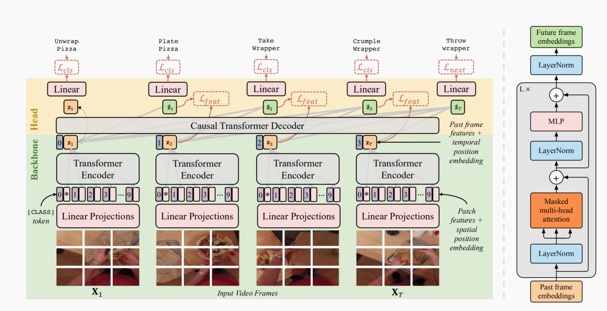

# 任务定义
  视频或未来场景预测可被视为最通用的预测形式。视频预测算法的目标是生成未来场景，通常以RGB图像或光流图的形式。生成的图像依次可用于各种任务，如动作预测、事件预测、流估计[6]、语义分割等。

# 任务难点

# 数据集介绍

# 参文介绍

1. Girdhar R, Grauman K. Anticipative Video Transformer[J]. arXiv preprint arXiv:2106.02036, 2021.
   
   地址：https://arxiv.org/abs/2106.02036
   会议：ICCV2021
   摘要翻译：我们提出了AVT，这是一个端到端的基于注意力的视频建模体系结构，它关注之前观察到的视频，以便预测未来的动作。我们联合训练模型来预测视频序列中的下一个动作，同时学习能够预测成功的未来帧特征的帧特征编码器。与现有的时间聚集策略相比，AVT的优点是既能保持观察到的动作的顺序进行，又能捕捉到长期依赖关系--这两点对于预期任务来说都是至关重要的。通过广泛的实验，我们发现AVT在四个流行的动作预期基准：EpicKitchens-55、EpicKitchens-100、EGTEA Gaze+和50-Salads上获得了最好的报告性能，并且在EpicKitchens-100CVPR‘21挑战中获得了第一名。

   创新点：

   数据集：EpicKitchens-55、EpicKitchens-100、EGTEA Gaze+和50-Salads

   代码地址：

   框架图：
     

2. 

# 其他
