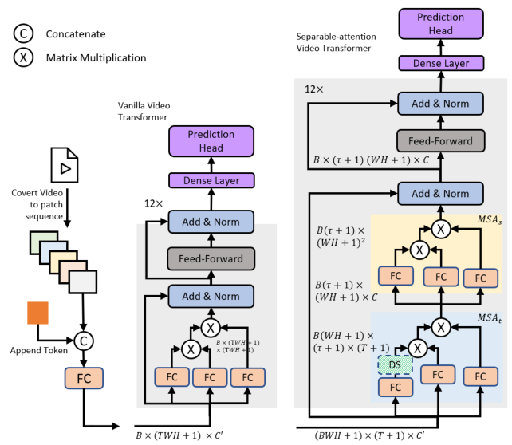
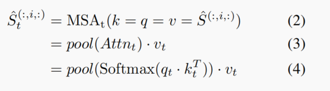
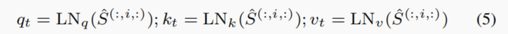
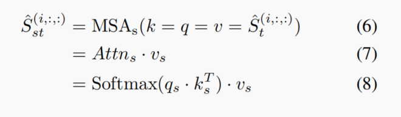
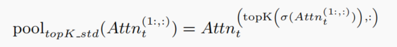
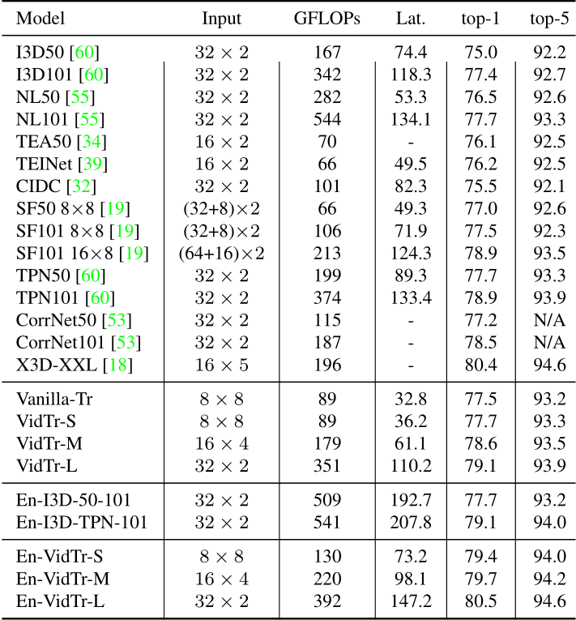
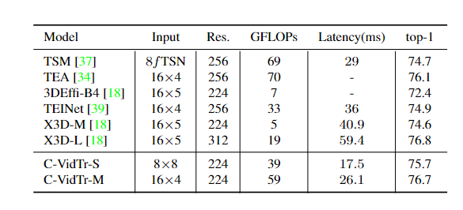
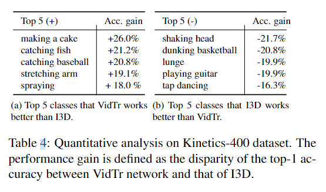
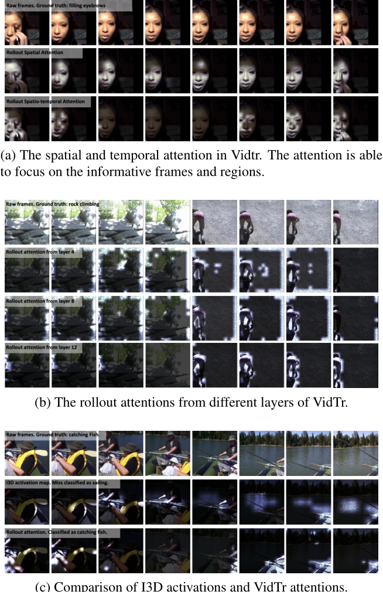

# VidTr: Video Transformer Without Convolutions

## 相关信息

论文名称: VidTr: Video Transformer Without Convolutions
 
论文作者: Yanyi Zhang, Xinyu Li, Chunhui Liu, Bing Shuai, Yi Zhu, Biagio Brattoli, Hao Chen, Ivan Marsic, Joseph Tighe
 
下载地址: https://arxiv.org/abs/2104.11746
 

## 论文概述
 
 一直以来以CNN作为基础架构的在完成视频分类任务值占据主要地位，并且取得了相对来讲不错的成绩，但是由于采用卷积操作就不可避免有卷积所带来的局限性，主要有：
   - 每一层有着有效的接收域，即每一个卷积核只能看到部分区域，这导致网络不能从全局角度来看，获取不到全局信息。
   - 通过堆叠卷积层搭建的网络，收敛速度慢，聚合信息速度慢，导致整体看下来并不是一个高效的操作。
  
  2017年谷歌提出了transformer，注意力又一次出现在大众眼前，之后很多视觉任务运用不同注意力机制获得不错的效果但是仍然没有摆脱卷积的限制。所以作者想到是否摒弃卷积操作，仅凭transformer架构，凭借transformer天然优势同样实现不俗的效果。

  在作者这个想法之前已经出现了video transformer（[An Image is Worth 16x16 Words: Transformers for Image Recognition at Scale](https://arxiv.org/abs/2010.11929),[Long-Term Feature Banks for Detailed Video Understanding](https://arxiv.org/abs/1812.05038)），当时那个架构缺点主要是对资源消耗过于夸张，简单说，仅仅224*224大小的16帧片段，在batch size为1情况下就需要16GB 显存。作者受到了R（2+1)D启发，时间信息和空间信息同时一步完成消耗大，是否可以让时空以某个顺序完成，作者发现这样确实有效降低计算量，效率也很高。之后，在此基础上作者又说明空间上有很多信息是冗余的，是否以一种排名策略进一步减少消耗，最终作者提出一种topK-std策略，不降低太多精度情况下保持了准确率。
  
  
### 论文动机

  传统基于卷积的视频分类建模方法一般是先提取图像特征，再对多帧图像特征进行聚合得到视频特征。考虑到 Transformer 模型在时序数据建模上具有先天优势，再加上 ViT 在图像分类领域上的成功，因此作者提出了 VidTr 这一基于 Transformer 直接对视频像素级数据进行时空特征提取的分类模型。

  作者首先提出了 vanilla video transformer 直接利用 ViT 对视频进行像素级数据建模，但存在内存消耗过大的问题，因此借鉴了R(2+1)D模型中3D卷积空域和时域分离执行的思想，提出了 separable-attention 分别执行 spatial & temporal attention，spatial attention 能够关注到信息量更大的patches，temporal attention 能够减少视频数据中存在的过多冗余。

## 论文要点

  1. 提出一种以视频作为输入，以transformer作为baseline的动作分类解决方案。
  2. 摒弃了传统卷积操作，以纯transformer形式做分类。
  3. 在最原始video transformer基础上，借助于R（2+1）D思想，分离时间和空间操作，有效降低计算量（由此可以看出来CNN架构的创新点仍然可以运用到transformer架构上）
  4. 提出一种topK-std策略，在注意力基础上进一步降低输入量，不降低过多准确率情况下降低消耗。
   
### 方法要素

  介绍方法要素之前先上图:stuck_out_tongue:
  

     
  

  
  相信有对transformer有一定了解的不难发现很多地方就是基础transformer东西，图片中左边是最原始的video transformer，右边是作者提出的架构，下面着重介绍什么是MSA_t,MSA_s,ds

#### Separable-Attention

  对于一个总的注意力计算公式为
     $$MSA = MSA_S(MSA_t(S))$$
  
  论文中说法“the spatial class tokens gather information from spatial patches in a single frame using spatial attention, and the temporal class tokens gather information from patches across frames (at same location) using temporal attention.”

  所以针对于MSA_t公式如下

  

     
  

  可以看出针对于t的注意力，只是常规注意力操作下只针对于S的第二个维度即T维度进行操作，计算公式相对简单。其中

  

     
  

  之后的空间注意力有：

  

     
  

#### DS操作

  关于作者为进一步降低计算效率，提出的topk—std策略，策略依据主要是在提出的网络中，时间注意力高度激活在一个小的当剪辑提供信息时的一组时间特征，当剪辑几乎没有附加语义信息时，注意力在剪辑的长度上均匀分布。基于这种直觉提出了一个基于 topK 的池化(topK std pooling) 按标准对实例进行排序注意力矩阵中每一行的偏差。公式如下：

  

     
  

  简单来说就是我只选择注意力最集中的地方

### 实验结果

在 Kinetics 400 数据集上，对比实验结果如下，对比当前基于卷积的SOTA综合优势十分明显

   

加了DS操作后轻量级架构准确率对比如下

   

对数据集中类别准确率差距有如下，符合预期VidTr在长时间动作分类具备优势，而基于CNN架构的处理短动作优势大：

   

作者同时对结果进行一系列可视化结果，如下

   

从可视化结果可以看出，如预期，DS操作可以去除掉重复的信息，VidTr在处理长时动作有很大优势

## 相关code

  目前相关代码作者说会开源，现在还没有开源

